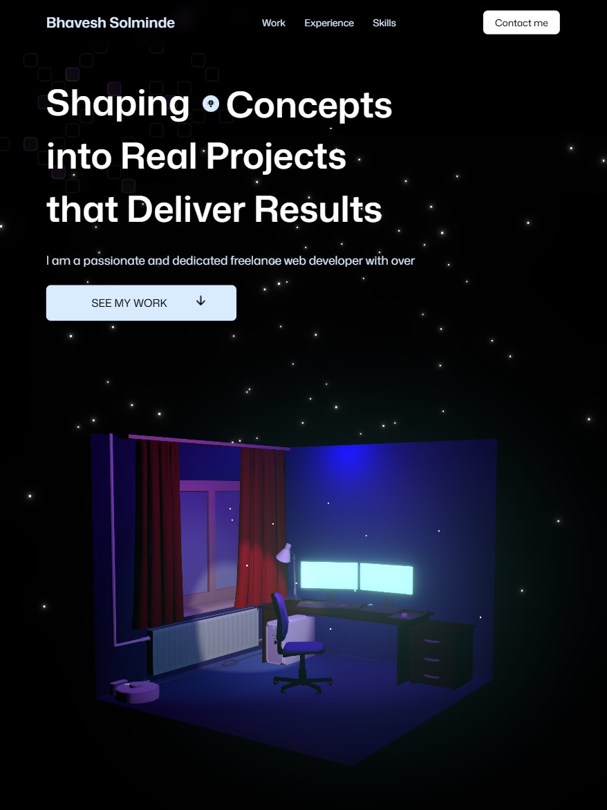

# 🚀 Personal Portfolio

> A modern, interactive portfolio website showcasing my skills as a full-stack developer with stunning 3D animations and smooth user experiences.

## 🌟 Live Demo

🔗 **Primary URL:** [https://portfolio-bhaveshs-projects-51e32c25.vercel.app](https://portfolio-bhaveshs-projects-51e32c25.vercel.app)

🔗 **Alternative URL:** [https://portfolio-navy-delta-f2nb38f4r5.vercel.app](https://portfolio-navy-delta-f2nb38f4r5.vercel.app)



## ✨ Features

- **🎨 Modern Design** - Clean, professional interface with dark theme
- **🎭 3D Animations** - Interactive Three.js scenes with custom 3D models
- **🌟 GSAP Animations** - Smooth text animations and scroll-triggered effects
- **📱 Fully Responsive** - Optimized for all devices and screen sizes
- **⚡ Performance Optimized** - Fast loading with Vite build system
- **🎯 Interactive Elements** - Animated counters, smooth scrolling, and hover effects
- **📧 Contact Integration** - EmailJS for seamless contact form functionality

## 🛠️ Tech Stack

### 🚀 Frontend Development

<p align="left">
  <a href="#"></a>
  <a href="#"></a>
  <a href="#"></a>
  <a href="#"></a>
  <a href="#"></a>
</p>

### 📚 Libraries & Tools

- **React 19** - Latest React with modern hooks
- **Three.js + React Three Fiber** - 3D graphics and animations
- **GSAP** - Professional-grade animations
- **Tailwind CSS** - Utility-first styling
- **EmailJS** - Client-side email integration
- **React CountUp** - Animated number counters
- **Vite** - Next-generation build tool

## 🎮 Key Animations

### 🎨 Hero Section

- **Text Slider Animation** - Rotating words with smooth transitions
- **3D Room Model** - Interactive workspace scene with custom lighting
- **Responsive 3D Controls** - Touch-friendly on mobile devices

### 📊 Animated Counters

- **Scroll-Triggered Counting** - Numbers animate when section becomes visible
- **GSAP ScrollTrigger** - Precise viewport detection
- **Performance Optimized** - Only animates when needed

### 🌈 Visual Effects

- **Selective Bloom** - Glowing effects on specific 3D elements
- **Custom Materials** - Tailored lighting and textures
- **Mood Lighting** - Professional 3D scene atmosphere

## 🚀 Getting Started

### Prerequisites

- Node.js (v18 or higher)
- npm or yarn

### Installation

1. **Clone the repository**

   ```bash
   git clone https://github.com/Bhavesh-Solminde/Portfolio.git
   cd Portfolio
   ```

2. **Install dependencies**

   ```bash
   npm install
   ```

3. **Start development server**

   ```bash
   npm run dev
   ```

4. **Open your browser**
   ```
   http://localhost:5173
   ```

### Build for Production

```bash
npm run build
npm run preview
```

## 📁 Project Structure

```
Portfolio/
├── public/
│   ├── images/          # Static images and textures
│   │   ├── textures/    # 3D model textures
│   │   └── icons/       # UI icons
│   └── models/          # 3D model files (.glb)
├── src/
│   ├── components/      # Reusable components
│   │   ├── HeroModels/  # 3D scene components
│   │   └── sections/    # Page sections
│   ├── constants/       # Application constants
│   └── styles/          # Global styles
└── README.md
```

## 🎯 Key Components

### 🏠 Hero Section (`Hero.jsx`)

- Animated text slider with rotating words
- 3D room scene integration
- Responsive layout system

### 🎬 3D Experience (`HeroExperience.jsx`)

- Three.js scene setup
- Mobile-optimized rendering
- Dynamic lighting system

### 📊 Animated Counter (`animatedCounter.jsx`)

- GSAP ScrollTrigger integration
- Smooth number animations
- Viewport-based triggering

### 🏠 3D Room Model (`Room.jsx`)

- Optimized 3D workspace scene
- Custom materials and textures
- Selective bloom effects

## 🎨 Customization

### 🎭 Animation Timing

```jsx
// Adjust scroll trigger points
start: "top 80%"; // Earlier trigger
start: "top 60%"; // Later trigger

// Animation duration
duration: 3; // 3 seconds
duration: 2; // 2 seconds
```

### 🎨 Color Scheme

```css
/* Update Tailwind colors in tailwind.config.js */
colors: {
  primary: '#your-color',
  secondary: '#your-color'
}
```

### 🌟 3D Scene Settings

```jsx
// Mobile optimization
pixelRatio={isMobile ? 1 : Math.min(window.devicePixelRatio, 2)}

// Camera positioning
position={isMobile ? [0, 0, 8] : [0, 0, 6]}
```

## 📱 Responsive Design

- **Desktop** - Full 3D experience with high-quality rendering
- **Tablet** - Optimized controls and layout adjustments
- **Mobile** - Performance-focused with simplified interactions

## 🚀 Performance Optimizations

- **Conditional 3D Rendering** - Device-specific quality settings
- **Lazy Loading** - Models and textures load on demand
- **Efficient Animations** - GSAP's optimized rendering pipeline
- **Mobile Adaptations** - Reduced quality for better performance

## 📧 Contact Integration

EmailJS integration for seamless contact form functionality:

- No backend required
- Direct email delivery
- Form validation
- Success/error handling

## 🔧 Development

### Available Scripts

- `npm run dev` - Start development server
- `npm run build` - Build for production
- `npm run preview` - Preview production build
- `npm run lint` - Run ESLint

### Environment Setup

Create `.env` file for EmailJS configuration:

```env
VITE_EMAILJS_SERVICE_ID=your_service_id
VITE_EMAILJS_TEMPLATE_ID=your_template_id
VITE_EMAILJS_PUBLIC_KEY=your_public_key
```

## 🌟 Features Showcase

### ✨ Interactive Elements

- Smooth scroll-triggered animations
- Hover effects on interactive elements
- Mobile-friendly touch interactions

### 🎨 Visual Design

- Modern dark theme with accent colors
- Professional typography
- Consistent spacing and layout

### ⚡ Performance

- Fast loading times with Vite
- Optimized 3D rendering
- Efficient asset management

## 📄 License

This project is licensed under the MIT License - see the [LICENSE](LICENSE) file for details.

## 🤝 Contributing

1. Fork the project
2. Create your feature branch (`git checkout -b feature/AmazingFeature`)
3. Commit your changes (`git commit -m 'Add some AmazingFeature'`)
4. Push to the branch (`git push origin feature/AmazingFeature`)
5. Open a Pull Request

## 👨‍💻 Author

**Bhavesh Solminde**

- GitHub: [@Bhavesh-Solminde](https://github.com/Bhavesh-Solminde)
- Portfolio: [Your Portfolio URL]

## 🙏 Acknowledgments

- Three.js community for amazing 3D capabilities
- GSAP team for professional animation tools
- React Three Fiber for seamless React integration
- Tailwind CSS for utility-first styling

---

⭐ **If you like this project, please give it a star!** ⭐
